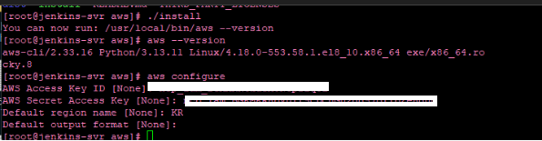

# CDN

## CDN 설치 및 Jenkinsfile 수정

1. 네이버클라우드에서 CDN을 사용한다.
2. CDN을 사용하는 레포지토리의 Jenkinsfile에 아래 내용을 추가한다.

```groovy
environment {
	DEPLOYMENT = "${env.PROFILE == 'canary' ? 'prod' : env.PROFILE}"
	// 아래껀 추후에 cdn 사용 시 활성화
	AWS_ACCESS_KEY_ID = credentials('NCP_ACCESS_KEY')
	AWS_SECRET_ACCESS_KEY = credentials('NCP_SECRET_KEY')
	BUCKET_URL = 'https://버킷주소' // 이건 바꿔줘야 함
	DOCKER_BUILDKIT = '1'
}
```

1. Jenkins 서버에서 AWS CLI 설치

```bash
# 1) 설치 파일 다운로드
curl "https://awscli.amazonaws.com/awscli-exe-linux-x86_64.zip" -o "awscliv2.zip"

# 2) 압축 해제 (unzip이 없으면 sudo apt install unzip 또는 yum install unzip)
unzip awscliv2.zip

# 3) 설치 스크립트 실행
sudo ./aws/install

# 4) 설치 확인
aws --version
```



추가로 알게된 사실: aws-cli 2.23.0 이후 버전을 사용할 경우, 위에서 생성한 `.aws/config` 파일 안에 아래 내용을 넣어주어야 오브젝트 스토리지 권한 에러가 안 생긴다. (공공존만 그런 걸 수도 있음)

```
[default]
request_checksum_calculation = WHEN_REQUIRED
response_checksum_validation = WHEN_REQUIRED
```

참고 URL: [https://www.gov-ncloud.com/v2/support/faq/prod/4514](https://www.gov-ncloud.com/v2/support/faq/prod/4514)