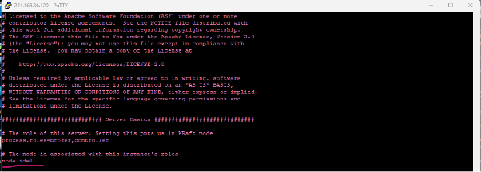

# Kafka

## Kafka 4.0.0 설치/구성 (KRaft)

### 1) 설치 파일 다운로드

- 원하는 버전(tgz) 다운로드
- 다운로드 파일을 설치 경로로 이동

```bash
wget https://dlcdn.apache.org/kafka/4.0.0/kafka_2.13-4.0.0.tgz
ls
mv kafka_2.13-4.0.0.tgz /usr/local/
```

---

### 2) 압축 해제 및 디렉터리 정리

- 설치 경로로 이동
- gzip 해제 → tar 압축 해제
- 디렉터리명을 `kafka`로 변경

```bash
cd /usr/local/
gzip -d kafka_2.13-4.0.0.tgz
tar xvf kafka_2.13-4.0.0.tar
mv kafka_2.13-4.0.0 kafka
```

---

### 3) Java 17 설치 및 기본 java 선택

- Kafka 4.0.0은 Java 17 사용
- JDK 17 설치 후 기본 java 버전 변경(문서 기준 2번)

```bash
dnf install java-17-openjdk-devel -y
alternatives --config java
```

---

### 4) PATH 등록 (.bash_profile)

- Kafka 실행 경로를 PATH에 추가 (설치 위치에 따라 경로 변경)

설정 예시(.bash_profile에 추가)

- `export PATH=$PATH:/usr/local/kafka/bin`

```bash
source .bash_profile
```

---

### 5) [server.properties](http://server.properties) 설정

- 로그 경로 수정
- 다중 서버 구성 시 `node.id`는 서버별로 서로 다른 값 적용
- 



- 해당 옵션이 없으면 수동으로 추가

```bash
vi /usr/local/kafka/config/server.properties
```


---

### 6) 호스트 등록 확인

- 서버 간 통신을 위해 `/etc/hosts`에 각 서버 등록 확인

```bash
cat /etc/hosts
```

---

### 7) KRaft UUID 생성 및 클러스터 포맷

- UUID 생성
- 3대 구성 시 동일 UUID로 각 서버를 포맷해야 같은 클러스터로 묶임
- 포맷 명령 형식: `kafka-storage.sh format -t <UUID> -c <properties 경로>`

```bash
kafka-storage.sh random-uuid
kafka-storage.sh format -t MAdctvXYTda29IUoGSZl8w -c /usr/local/kafka/config/server.properties
```

---

### 8) Kafka 기동

```bash
kafka-server-start.sh -daemon /usr/local/kafka/config/server.properties
```

---

### 9) 동작 테스트 (토픽 생성/조회)

- 토픽 생성은 1번 서버에서만 수행(문서 기준)
- 토픽 리스트에 `test`가 보이면 정상

```bash
kafka-topics.sh --create --bootstrap-server goh-kafka-prod001:9092,goh-kafka-prod002:9092,goh-kafka-prod003:9092 --topic test
kafka-topics.sh --bootstrap-server goh-kafka-prod001:9092,goh-kafka-prod002:9092,goh-kafka-prod003:9092 --topic test --list

# (예시)
./kafka-topics.sh --create --bootstrap-server 172.20.140.40:9092,172.20.140.41:9092,172.20.140.42:9092 --topic test
```

---

### 10) 컨트롤러/브로커 역할 분리 시

- 컨트롤러 역할: `controller.properties`
- 브로커 역할: `broker.properties`

[broker.properties](http://broker.properties) 주요 예시

- `process.roles=broker`
- `node.id=4` (브로커 서버마다 다르게)
- `controller.quorum.voters=1@브로커서버#1-IP:9093,2@브로커서버#2-IP.31:9093,3@브로커서버 #3-IP:9093`
- `listeners=PLAINTEXT://localhost:9092`
- `inter.broker.listener.name=PLAINTEXT`
- `advertised.listeners=PLAINTEXT://172.20.140.40:9092` (브로커 서버 본인 IP)